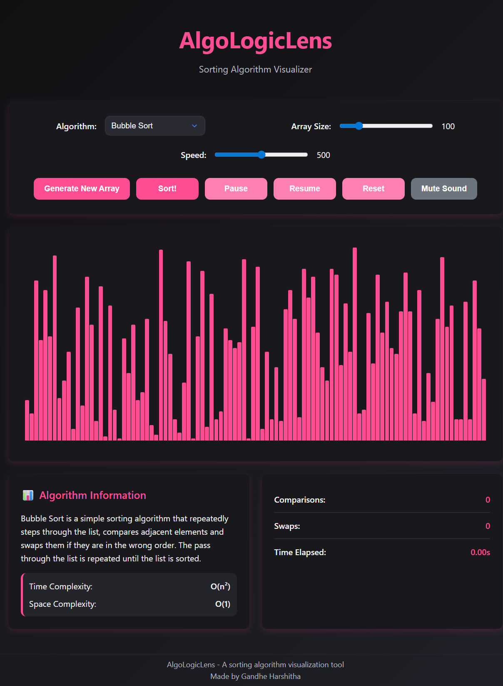

<div align="center">

# AlgoLogicLens

### Interactive Sorting Algorithm Visualizer

AlgoLogicLens is a modern web-based sorting algorithm visualizer that helps users understand how different sorting algorithms work through real-time animations, interactive controls, and live performance statistics.

<br>



</div>

---

# Overview

AlgoLogicLens visually demonstrates how sorting algorithms manipulate data step-by-step. The project combines animation, statistics tracking, and responsive design to create an engaging learning experience for students, programmers, and algorithm enthusiasts.

---

# Features

- Real-time sorting visualization
- Interactive controls for array generation
- Adjustable sorting speed
- Customizable array size
- Live statistics tracking
  - Comparisons
  - Swaps
  - Execution time
- Pause, Resume, and Reset functionality
- Responsive UI for desktop and mobile
- Audio feedback during sorting
- Dark mode compatible design

---

# Algorithms Implemented

## Comparison-Based Algorithms
- Bubble Sort
- Selection Sort
- Insertion Sort
- Merge Sort
- Quick Sort
- Heap Sort
- Shell Sort
- Comb Sort
- Cocktail Shaker Sort
- Gnome Sort
- Cycle Sort
- Pancake Sort
- Stooge Sort
- Odd-Even Sort
- Tim Sort
- Bitonic Sort

## Non-Comparison-Based Algorithms
- Counting Sort
- Radix Sort
- Bucket Sort
- Pigeonhole Sort
- Bead Sort

## Educational / Experimental Algorithms
- Bogo Sort

---

# Tech Stack

- HTML5
- CSS3
- JavaScript (Vanilla JS)

---

# Project Structure

```bash
AlgoLogicLens/
├── .github/
├── algorithms/
├── site-data/
├── index.html
├── styles.css
├── main.js
├── algoEngine.js
└── README.md
